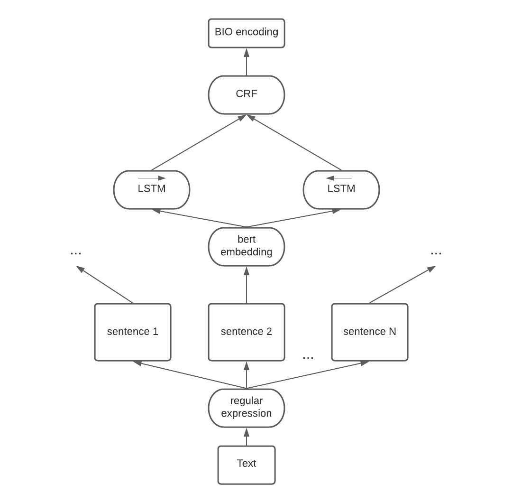

# Named-entity recognition

## Description
Данная модель осуществляет в тексте поиск именнованных сущностей следующего вида:
  1. даты и все, что к ним относится (например, на следующей неделе - дата)
  2. именованные личности (например, Робин Гуд - именованная личность)
  3. наименования организаций

В данной работе применяется архитектура BiLSTM + CRF, а также используется BERT-embedding:

## Install

Please make sure the release file is unpacked under a Web-accessible
directory. You shall see the following files and directories:

      demos/               demos
      framework/           framework source files
      requirements/        requirement checker
      CHANGELOG            describing changes in every Yii release
      LICENSE              license of Yii
      README               this file
      UPGRADE              upgrading instructions
